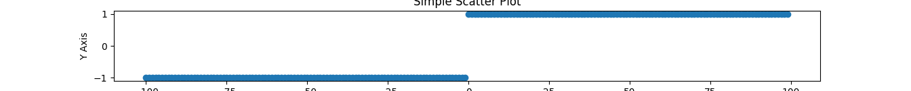

## Aufgabe 1

a) Gegeben ist folgende Reihe:
$$\sum_{k=0}^\infty \frac {k^2}{2^k}$$
Diese soll auf Konvergenz untersucht werden. Da dies keine geometrische Reihe, versuchen wir es mit dem Quotientenkriterium:

Sei $a_n = \frac {n^2}{2^k}$. Bestimmen wir nun das Verhältnis $q$:

$$q = \lim_{n \rightarrow \infty} \lvert \frac {a_{n+1}} {a_n} \rvert$$
$$=\lim_{n \rightarrow \infty}\ \lvert \frac {\frac {(n+1)²}{2^{n+1}}} {\frac {n^2}{2^n}} \rvert$$
$$=\lim_{n \rightarrow \infty}\ \lvert \frac {(n+1)^2}{2^{n+1}} \cdot \frac {2^n}{n^2} \rvert$$
$$=\lim_{n \rightarrow \infty} \ \lvert \frac {(n+1)^2}{2^n \cdot 2} \cdot \frac{2^n}{n^2} \rvert$$
$$=lim_{n \rightarrow \infty} \ \lvert \frac {(n+1)^2}{2n^2} \rvert$$
$$=lim_{n \rightarrow \infty} \ \lvert \frac {n^2 + 2n + 1}{2n^2} \rvert$$
Da der Grenzwert gegen $+\infty$ strebt gilt:
$$= lim_{n \rightarrow \infty}\ \frac {n^2 + 2n + 1}{2n^2}$$
$$= \lim_{n \rightarrow \infty}\ \frac{n^2(1+\frac 2 n + \frac 1 {n^2})}{n^2\cdot2}$$
$$=\lim_{n \rightarrow \infty}\ \frac {1+\frac 2 n+\frac 1 {n^2}}{2}$$
$$= \frac {1 + 0 + 0}{2} = \frac 1 2 $$

Da unser Verhältnis gegen einen Wert $<1$ strebt, konvergiert die Reihe.

b) Gegeben ist die Reihe:
$$\sum_{k=1}^\infty \frac{k}{2k+1}$$
Da es sich nicht um eine geometrische Reihe handelt, betrachten wir das Quotientenkriterium:

Sei $a_n = \frac n {2n+1}$. Bestimmen wir nun das Verhältnis $q$:

$$q = \lim_{n \rightarrow \infty} \lvert \frac {a_{n+1}} {a_n}\rvert$$
$$=\lim_{n \rightarrow \infty} \lvert \frac{\frac{n+1}{2(n+1)+1}}{\frac{n}{2n+1}} \rvert$$
$$=\lim_{n \rightarrow \infty} \lvert \frac{n+1}{2(n+1)+1} \cdot \frac {2n+1} n \rvert$$

$$=\lim_{n \rightarrow \infty} \lvert \frac{n+1}{2n+2+1} \cdot \frac{2n+1}n \rvert$$
$$=\lim_{n \rightarrow \infty} \lvert \frac{n+1}{2n+3} \cdot \frac{2n+1}{n} \rvert$$
$$=\lim_{n \rightarrow \infty} \lvert \frac{(n+1)(2n+1)}{n(2n+3)}\rvert$$
$$=\lim_{n \rightarrow \infty} \lvert \frac{2n^2+n+2n+1}{2n^2+3n} \rvert$$
$$=\lim_{n \rightarrow \infty} \lvert \frac{2n^2+3+1}{2n^2+3}\rvert$$
$$=\lim_{n \rightarrow \infty} \lvert \frac{(2n^2+3)(1+\frac 1 {2n^2+3})}{(2n^2+3)} \rvert$$
$$=\lim_{n \rightarrow \infty} 1 + \frac 1 {2n^2+3} = 1$$

Da das Verhältnis $q=1$ beträgt, kann uns das Quotientenkriterium keine Aussage bezüglich der Konvergenz der Reihe geben.

Betrachten wir die Reihenglieder sehen wir, dass diese nicht beschränkt sind. Die Reihe ist also monoton wachsend, hat aber keine Schranke. Dementsprechend konvergiert diese Reihe nicht.

c) Gegeben ist die Reihe:
$$\sum_{k=1}^\infty \frac{2^k}{(2k)!}$$
Da es sich nicht um eine geometrische Reihe handelt, verwenden wir zunächst das Quotientenkriterium um eine Aussage über dessen Konvergenzverhalten zu tätigen. 

Sei $a_n = \frac{2^k}{(2k)!}$. Bestimmen wir nun das Verhältnis $q$:

$$q = \lim_{n \rightarrow \infty}\ \lvert \frac{a_{n+1}}{a_n} \rvert$$
$$=\lim_{n \rightarrow \infty}\ \lvert \frac {\frac{2^{n+1}}{(2(n+1))!}} {\frac{2^n}{(2n)!}} \rvert$$
$$=\lim_{n \rightarrow \infty}\ \lvert \frac{2^{n+1}}{(2(n+1))!} \cdot \frac{(2n)!}{2^n} \rvert$$
$$=\lim_{n \rightarrow \infty}\ \lvert \frac{2^n \cdot 2}{(2(n+1))!} \cdot \frac{(2n)!}{2^n} \rvert$$

$$=\lim_{n \rightarrow \infty}\ \lvert \frac{2}{(2(n+1))!} \cdot (2n)! \rvert$$
$$=\lim_{n \rightarrow \infty}\ \lvert \frac{2}{(2n+2)!} \cdot (2n)! \rvert$$
$$=\lim_{n \rightarrow \infty}\ \lvert \frac{2}{(2n)! \cdot (2n+1) \cdot(2n+2)} \cdot (2n)! \rvert$$
$$=\lim_{n \rightarrow \infty}\ \lvert \frac{2}{(2n+1) \cdot(2n+2)} \rvert = 0$$
Da unser Verhältnis gleich 0 ist, gilt die Bedigung $q < 1$ und somit ist bestätigt, dass die Reihe konvergiert.

d) Gegeben ist die Reihe:
$$\sum_{k=1}^{\infty} \frac 1 {\sqrt k}$$
Seien $a1_n = \frac 1 {\sqrt k}; a2_n = \frac 1 k$  und  $s1_n = \sum_{k=1}^{\infty} \frac 1 {\sqrt k}; s2_n = \sum_{k=1}^{\infty} \frac 1 k$. 

An sich fällt auf, dass $\forall n \in \mathbb{N}: a1_n \geq a2_n$. Somit ist die Reihe $s2_n$ eine Minurante von $s1_n$. Nach dem Minurantenkriterium können wir sagen, dass $s1_n$ nicht konvergiert.

## Aufgabe 2 

a) Gegeben ist die Reihe:

$$s_n = \sum_{k=0}^{n} (\frac 2 3)^k$$
Betrachten wir dessen Folgeglieder:

$$s_1 = (\frac 2 3)^0 + (\frac 2 3)¹ = 1+ \frac 2 3 = \frac 5 3$$
$$s_2 = (\frac 2 3)^0 + (\frac 2 3)¹ + (\frac 2 3)² = 1+ \frac 2 3 + \frac 4 9$$
$$s_3 = (\frac 2 3)^0 + (\frac 2 3)¹ + (\frac 2 3)² + (\frac 2 3)³ = 1+ \frac 2 3 + \frac 4 9 + \frac 8 {27}$$
$$s_4 = (\frac 2 3)^0 + (\frac 2 3)¹ + (\frac 2 3)² + (\frac 2 3)³ + (\frac 2 3)^4 = 1+ \frac 2 3 + \frac 4 9 + \frac 8 {27} + \frac {16} {81}$$

Wir sehen,dass es sich um eine geometrische Reihe handelt, welche konvergiert und den Grenzwert $\frac 1 {1-q}$ hat ($q$ ist in dem Fall $\frac 2 3$).

Bestimmen wir also den Grenzwert: 
$$\lim_{n \rightarrow \infty} \sum_{k=0}^n\ (\frac 2 3)^k = \frac 1 {1-\frac 2 3}$$
$$=\frac 1 {\frac 3 3 - \frac 2 3}$$
$$=\frac 1 {\frac 1 3} = 3$$

b) Gegeben ist die Reihe:
$$\sum_{k = 0}^{\infty} \frac {2^k}{3^k} = \sum_{k=0}^{\infty} (\frac 2 3)^k$$

Das es sich hierbei um die selbe Reihe handelt, wie im Aufgabenteil a), ist dessen Grenzwert 3.

c) Gegeben ist die Reihe:
$$\sum_{k=0}^{\infty} \frac {2^k-1}{3^k} = \sum_{k=0}^{\infty}\frac {2^k}{3^k} - \frac 1 {3^k}$$
Diese Summe können wir aufteilen:
$$\sum_{k=0}^{\infty} \frac {2^k}{3^k} - \sum_{k=0}^{\infty} \frac 1 {3^k}$$

Den Grenzwert der ersten Summe kennen wir schon. Es muss also noch der Grenzwert der Reihe $\sum_{k=0}^{\infty} \frac 1 {3^k}$ bestimmt werden. Betrachten wir die Reihe:

$$\sum_{k=0}^{\infty} \frac 1 {3^k}$$

So sieht man, dass man diese auch als folgende Reihe umformen kann:

$$\sum_{k=0}^{\infty} (\frac 1 3)^k$$
Dies ist wiederum eine geometrische Reihe, dessen Grenzwert wir durch die Formel $\frac 1 {1-q}$ (mit $q = \frac 1 3$) bestimmen können:

$$\lim_{n \rightarrow \infty}\ \sum_{k = 0}^n (\frac 1 3)^k$$
$$=\frac 1 {1-\frac 1 3}$$
$$=\frac 1 {\frac 3 3 - \frac 1 3}$$
$$=\frac 1 {\frac 2 3} =\frac 3 2$$

Bestimmen wir also nun den Grenzwert des Terms:
$$lim_{n \rightarrow \infty} \sum_{k=0}^n \frac {2^k}{3^k} - \sum_{k=0}^n (\frac 1 3)^k$$
Setzen wir nun die Grenzwerte der Summen ein:
$$= 3 - \frac 3 2$$
$$= \frac 6 2 - \frac 3 2$$
$$= \frac 3 2$$

Somit ist unser Grenzwert $\frac 3 2$.

## Aufgabe 3

Gegeben ist die Reihe:
$$\sum_{k=1}^{\infty} \frac 1 {k^2}$$

Es gilt zu zeigen, dass diese Reihe konvergiert. Da dies keine geometrische Reihe ist, probieren wir es zunächst mit dem Quotientenkriterium:

Sei 
$$a_n = \frac 1 {n^2}$$ und $$q = \lim_{n \rightarrow \infty} \lvert \frac {a_{n+1}} {a_n} \rvert$$
Bestimmen wir zunächst $q$:

$$q = \lim_{n \rightarrow \infty} \lvert \frac {a_{n+1}} {a_n} \rvert$$
$$=\lim_{n \rightarrow \infty} \lvert \frac {\frac 1 {(n+1)²}} {\frac 1 {n^2}} \rvert$$
$$=\lim_{n \rightarrow \infty} \lvert {\frac 1 {(n+1)²}} \cdot {\frac {n^2} 1} \rvert$$
$$=\lim_{n \rightarrow \infty} \lvert {\frac 1 {n^2+2n+1}} \cdot {\frac {n^2} 1} \rvert$$
$$=\lim_{n \rightarrow \infty} \lvert {\frac {n^2} {n^2+2n+1}} \rvert$$
$$=\lim_{n \rightarrow \infty} \lvert {\frac {n^2} {n^2 \cdot(1+\frac 2 n+\frac 1 {n^2})}} \rvert$$
$$=\lim_{n \rightarrow \infty} \lvert {\frac 1 {1+\frac 2 n+\frac 1 {n^2}}} \rvert$$
Da $n$ gegen $+\infty$ strebt gilt:
$$=\lim_{n \rightarrow \infty} {\frac 1 {1+\frac 2 n+\frac 1 {n^2}}} = \frac 1 1 =1$$

Da wir für unser Verhältnis $q$ 1 erhalten, können wir durch das Quotientenkriterium keine Aussage über die Konvergenz der Reihe machen.

Verwenden wir also das Majorantenkriterium. Jedoch muss davor gezeigt werden, dass
$$\sum_{k=2}^n \frac 1 {(k-1)k} = \sum_{k=2}^n (\frac 1 {k-1} - \frac 1 k)$$
Dies können wir durch folgende Umformung zeigen:
$$\frac 1 {k-1} - \frac 1 k$$
$$=\frac k {k(k-1)} - \frac {(k-1)}{k(k-1)}$$
$$=\frac {k - (k-1)} {k(k-1)}$$
$$=\frac {k-k+1} {k(k-1)}$$
$$=\frac 1 {k(k-1)} =\frac 1 {(k-1)k}$$
Nun gilt es noch zu zeigen, dass folgendes gilt:

$$\sum_{k=2}^n \frac 1 {(k-1)k} = 1 - \frac 1 n$$

Dies können wir beweisen anhand vollständiger Induktion:

###### Zu zeigen ist:

$$\forall n \in \mathbb{N}: \sum_{k=2}^n \frac 1 {(k-1)k} = 1 - \frac 1 n$$
###### Induktionsanfang mit n=2:
$$\sum_{k=2}^{2} \frac 1 {(k-1)k} = 1 - \frac 1 2$$

$$\Leftrightarrow \frac 1 {(2-1)2} = 1 - \frac 1 2$$
$$\Leftrightarrow \frac 1 {(1 \cdot2)} = 1 - \frac 1 2$$
$$\Leftrightarrow \frac 1 {2} = \frac 1 2$$

###### Induktionsbehauptung: 
Sei $n \in \mathbb{N}: \sum_{k=2}^n \frac 1 {(k-1)k} = 1 - \frac 1 n$

###### Induktionsschritt ($n \rightarrow n+1$ mit Ziel $1 - \frac 1 {n+1}$):

$$\sum_{k=2}^{n+1} \frac 1 {(k-1)k}$$
$$=\sum_{k=2}^{n} \frac 1 {(k-1)k} + \frac 1 {((n+1)-1)(n+1)}$$
$$=\sum_{k=2}^{n} \frac 1 {(k-1)k} + \frac 1 {(n(n+1)}$$
$$=\sum_{k=2}^{n} \frac 1 {(k-1)k} + \frac 1 {(n^2+n)}$$
$$=1 - \frac 1 n + \frac 1 {(n^2+n)}$$
$$=\frac n n - \frac 1 n + \frac 1 {n^2+n}$$
$$=\frac {n-1} n + \frac 1 {n^2+n}$$
$$=\frac {(n-1)(n+1)}{n(n+1)} + \frac 1 {n^2+n}$$

$$=\frac {n^2-1²}{n^2+n} + \frac 1 {n^2+n}$$
$$=\frac {n^2-1}{n^2+n}+\frac 1 {n^2+n}$$
$$=\frac {n^2-1+1}{n^2+n}$$
$$=\frac {n^2} {n^2+n}$$
$$=\frac {n^2}{n(n+1)}$$
$$=\frac n {n+1}$$
$$= \frac {n+(1-1)}{n+1}$$
$$= \frac {n+1} {n+1} - \frac 1 {n+1}$$ 
$$= 1- \frac 1 {n+1}$$ 
																		$\blacksquare$

Dadurch haben wir gezeigt, dass die Reihe $\sum_{k=2}^{n+1} \frac 1 {(k-1)k}$ gegen $= 1- \frac 1 {n+1}$ konvergiert. Und da $\frac 1 {k^2} < \frac 1 {(k-1)k}$ gilt, greift das Majorantenkriterium und somit kovergiert auch $\sum_{k=0}^{\infty} \frac 1 {k^2}$.

## Aufgabe 4
a) Dadurch, dass für $x \neq 0$, $\frac x {\lvert x \rvert}$ gilt, gilt $\forall x \in \mathbb{R} < 0: f(x) = -1$ und $\forall x \in \mathbb{R} > 0: f(x) = 1$, wodurch $f$ für $x \neq 0$ stetig ist.

b) Betrachten wir die Folge $a_n = 1 + \frac 1 n$. Diese hat unterschiedliche Grenzwerte, je nachdem von wo man die 0 annähert.

c) 

## Aufgabe 5
Gegeben ist $\frac 1 2 x² = \sin(x) \Leftrightarrow \frac 1 2 x² - \sin(x) = 0$

Betrachten wir $f(1) \cdot f(2)$:

$$f(1)\cdot f(2)$$
$$=(\frac 1 2 \cdot 1² - \sin(1)) \cdot (\frac 1 2 \cdot 2² -\sin(2))$$
$$=(\frac 1 2 \cdot 1 - \sin(1))\cdot(\frac 1 2 \cdot 4 - \sin(2))$$
$$=-0.37$$

Dadurch, dass $f(a) \cdot f(b) < 0$ ist, greift der Zwischenwertsatz, wodurch es für die Gleichung 
$$\frac 1 2 x²-\sin(x)=0$$ eine Lösung im Intervall $[1,2]$ gibt. 
