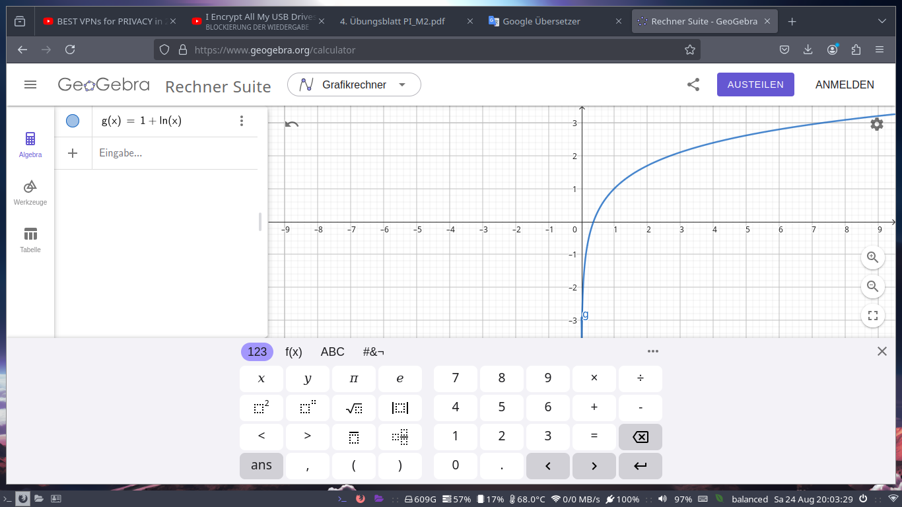

## Aufgabe 1

Gegeben ist die Funktion:

$$f: \mathbb{R}\\,\{0,1\} \rightarrow \mathbb{R}: f(x)= \frac{x³-x²+3x-3}{x²-x}$$
Bestimmen wir die folgenden Grenzwerte:

- $\lim_{x \rightarrow 0}\ \frac{x³-x²+3x-3}{x²-x} \Rightarrow$ ist nicht existent!
- $\lim_{x \rightarrow 1} \frac{x³-x²+3x-3}{x²-x}$:
$$\lim_{x \rightarrow 1} \frac{x³-x²+3x-3}{x²-x}$$
$$=\lim_{x \rightarrow 1} \frac{x²(x-1)+3(x-1)}{x(x-1)}$$
$$=\lim_{x \rightarrow 1} \frac{(x-1)(x²+3)}{x(x-1)}$$
$$=\lim_{x \rightarrow 1} \frac{x²+3}{x} = 4$$
- $\lim_{x \rightarrow 2}$:
$$\lim_{x \rightarrow 2} \frac{x³-x²+3x-3}{x²-x}$$
$$= \frac{2³-2²+3\cdot2-3}{2²-2}$$
$$=\frac{8-4+6-3}{4-2}$$
$$=\frac{4+6-3}{2} = \frac 7 2$$

## Aufgabe 2

Gegeben ist die Reihe:
$$\sum_{k = 0}^{\infty} \frac 1 {2^kk!}$$

Betrachten wir dafür:
$$\lim_{n \rightarrow \infty} \sum_{k=0}^n \frac 1 {2^kk!}$$
$$=\lim_{n \rightarrow \infty} \sum_{k=0}^n \frac 1 {2^k} \cdot \frac 1 {k!}$$
$$=\lim_{n \rightarrow \infty} (\frac 1 {2^0} \cdot \frac 1 {0!}) + (\frac 1 {2^1} \cdot \frac 1 {1!}) + (\frac 1 {2^2} \cdot \frac 1 {2!}) + (\frac 1 {2^3} \cdot \frac 1 {3!}) + ... + (\frac 1 {2^n} \cdot \frac 1 {n!})$$
$$=\lim_{n \rightarrow \infty} 1 + (\frac 1 2) + (\frac 1 4 \cdot \frac 1 2) + (\frac 1 8 \cdot \frac 1 6) + ... + (\frac 1 {2^n} \cdot \frac 1 {n!})$$
$$=\lim_{n \rightarrow \infty} 1 + \frac 1 2 + \frac 1 8 + \frac 1 {48} + ... + (\frac 1 {2^n} \cdot \frac 1 {n!})$$
$$\approx 1 + \frac 1 2 + \frac 1 8 + \frac 1 {48}$$
$$\approx \frac {48}{48} + \frac {24} {48} + \frac 6 {48} + \frac 1 {48}$$
$$\approx \frac {79}{48} \approx 1.6$$

## Aufgabe 3

Gegeben sei die Funktion:
$$f: \mathbb{R} \rightarrow \mathbb{R}: f(x)=e^{2x}-3$$

a) Berechnen wir zunächst dessen Nullstellen:
$$f(x) = 0$$
$$\Leftrightarrow e^{2x}-3 = 0 \vert +3$$
$$\Leftrightarrow e^{2x} = 3\vert \ln$$
$$\Leftrightarrow 2x = ln(3)\vert \div 2$$
$$\Leftrightarrow x = \frac {\ln(3)} 2$$

b) 

Es ist zu sehen, dass die Funktion stetig ist und somit auch umkehrbar an der ersten Winkelhalbierenden.

c) Die Wertemenge $W_f$ für $f$ lautet: $(-3, \infty)$.

d) Ermitteln wir nun die Umkehrfunktion für $f$:

$$f(x) = e^{2x}-3$$
$$y = f(x)$$
$$\Leftrightarrow y = e^{2x} -3 \vert +3$$
$$\Leftrightarrow y + 3 = e^{2x} \vert \ln$$
$$\Leftrightarrow \ln(y+3) = 2x \vert \div 2$$
$$\Leftrightarrow \frac{\ln(y+3)}2 = x$$
## Aufgabe 4

a) Gegeben ist:
$$\ln(x²)=2\ln(x)\ \vert e^x$$
$$\Leftrightarrow e^{\ln(x²)} = e^{2\ln(x)}$$
$$\Leftrightarrow e^{\ln(x²)} = (e^{\ln(x)})²$$
$$\Leftrightarrow x² = (x)²$$
$$\Leftrightarrow x² = x²$$
b) Zu vereinfachen ist folgender Term: 
$$\ln(\frac{a²b}e) - \frac{4\ln(a)+\ln(b)}{2} +1$$
$$=\ln(\frac{a²b}e) - \frac{\ln(a⁴)+\ln(b)}{2} + 1$$
$$=\ln(\frac{a²b}e) - \frac{\ln(a⁴b)}2+1$$
$$=\ln(a^2b)-\ln(e)-\frac{\ln(a^4b)}{2}+1$$
$$=\ln(a^2b)-1-\frac{\ln(a^4b)}{2}+1$$
$$=\ln(a^2b)-\frac{\ln(a^4b)}{2}$$
$$=\frac{2\ln(a^2b)-\ln(a^4b)}{2}$$
$$=\frac{\ln(a^4b^2)-\ln(a^4b)}{2}$$
$$=\frac{\ln(\frac{a^4b^2}{a^4b})}{2}$$
$$=\frac{\ln(b)}{2}$$

c) Gegeben ist die Funktion $f: \mathbb{R}⁺ \rightarrow \mathbb{R}, f(x)=\ln(ex)$

Vereinfachen wir die Funktion:
$$\ln(ex)$$
$$=\ln(e) + \ln(x)$$
$$=1 + \ln(x)$$

## Aufgabe 5

a) Gegeben sei folgende Gleichung:

$$\ln(x²-1)=-1 \vert e^x$$
$$\Leftrightarrow x²-1=e^{-1} \vert +1$$
$$\Leftrightarrow x²=e^{-1}+1\vert \sqrt{}$$
$$\Leftrightarrow x = \sqrt{e^{-1}+1} \lor x = - \sqrt{e^{-1}+1}$$

b) Gegeben sei die folgende Gleichung:
$$e^{x²-1}-e^x=0\vert +e^x$$
$$\Leftrightarrow x²-1=x \vert -x$$
$$\Leftrightarrow x²-x-1 = 0\vert +1$$
$$\Leftrightarrow x²-x=1$$
$$\Leftrightarrow x²-x+(\frac 1 2)² = 1 + (\frac 1 2)²$$
$$\Leftrightarrow (x-\frac 1 2)² = 1 + \frac 1 4$$
$$\Leftrightarrow (x - \frac 1 2)² = \frac 4 4 + \frac 1 4$$
$$\Leftrightarrow (x - \frac 1 2)² = \frac 5 4 \vert \sqrt {}$$
$$\Leftrightarrow x-\frac 1 2 = \frac {\sqrt 5} 2\ \vert + \frac 1 2 \lor\ x-\frac 1 2 = - \frac {\sqrt 5} 2 \vert + \frac 1 2$$
$$\Leftrightarrow x = \frac{\sqrt 5 +1} 2\ \lor\ x = \frac{1-\sqrt 5}2$$

